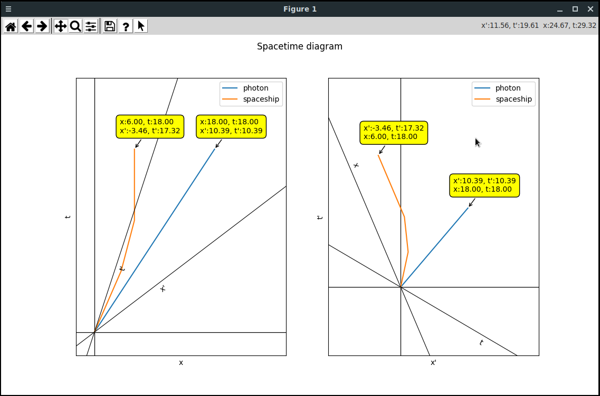

# SR Spacetime Diagram

This simple Python app produces SR spacetime diagrams from the user-provided data.

The diagrams can be exported to many formats (e.g. pdf, jpg, png).

It's also possible to draw a second diagram, using O' as the observer, side by side with O diagram. This could help in
many ways, e.g. clearly visualizing the relativity of simultaneity.

**Meters are used as units for time (and space), so that light takes one meter of time to travel one meter. This means that `c=1`**

## 1. How to run it

The app can be launched either using the provided executable or directly from the source code

### 1.1 Executable file

The `dist/` folder contains a GNU/Linux and a Windows executable that can be used to launch the app.

The executable files were generated using **PyInstaller**

### 1.2 Source files

You need these libraries:

- NumPy
- Matplotlib
- SciPy
- PyYaml

You can launch the app using `spacetime_diagram.py`.

## 2 How to provide input data

Input data is provided via the `input.yml` file. Don't worry if you are not familiar with `Yaml` syntax, it's very easy, 
and the file contains examples.

It's located both in the project folder and the `dist/` folder. You should edit the first one if launching from sources,
the latter if launching from the executable.

The `input.yml` file contains comments and examples, so look at it for further details about how input data is
structured.

Basically, the file is used:

- to provide the velocity of O', expressed in terms of `c` (e.g 0.6).
- to provide world lines. Each world line is composed of a label and a set of events. To plot the world line, it is
  assumed that velocity is constant between two consecutive events.

## 3 Plot toolbar

The plot toolbar contains buttons that provide useful functionalities.

It's possible to zoom in and zoom out, pan axes, export to file and enable/disable annotations for provided events. When
annotations are enabled, hovering near an event will display a box containing its coordinates, in O and O' coordinates.
Use `m` to enable/disable annotations, or the dedicated button.

Click on the `question mark button` for a full list of shortcuts.

The toolbar also displays the current coordinates of the cursor, in both O and O' coordinates.

## 4 How to generate executable files using PyInstaller

From the project folder, just run `pyinstaller -F spacetime_diagram.py`.

The generated bundle will be placed in `dist` folder.
